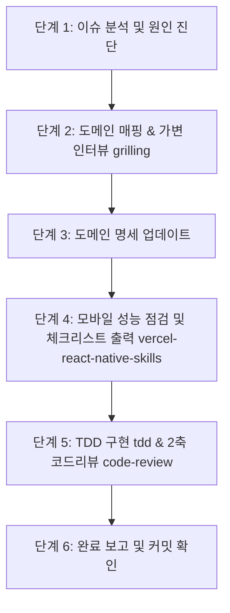

# handle-issue 워크플로우

운영 중 발견된 버그(예: 체결 통보 누락으로 인한 유령 보유 종목 방치), 예외 상황, 기능 개선 요구사항을 **DDD 도메인 중심**, **가변 인터뷰 기반 요구사항 구체화**, **모바일 성능 최적화**, **TDD 및 2축 코드리뷰** 파이프라인으로 체계적으로 해결하는 엔드투엔드 워크플로우입니다.

---

## 1. 워크플로우 핵심 철학

> **"무작정 코드를 고치지 않고, 인터뷰로 숨은 엣지 케이스를 털어내며, 도메인 불변식과 모바일 성능 규칙을 정의한 뒤 TDD로 구현한다."**

1. **도메인 격리**: 문제가 발생한 비즈니스 영역(도메인)을 명확히 식별합니다.
2. **사전 인터뷰 ([grilling](file:///C:/Users/user/.gemini/config/skills/grilling/SKILL.md))**: 복합 이슈나 정책 결정이 필요할 때 질문 라운드를 통해 불변식을 명확히 합의합니다 (단순 버그는 자체 판단 하에 신속 진행 가능).
3. **도메인 스펙 동기화**: 해당 도메인 문서(`feature.md`, `README.md` 등)에 새로운 방어 규칙과 스펙을 먼저 기록합니다.
4. **모바일 규칙 준수 ([vercel-react-native-skills](file:///C:/Users/user/.gemini/config/skills/vercel-react-native-skills/SKILL.md))**: React Native 환경에 맞는 렌더링, 리스트 가상화, 상태 최적화 가이드라인을 점검하고 체크리스트를 표로 출력합니다.
5. **표준 TDD 구현 및 2축 검증 ([tdd](file:///C:/Users/user/.gemini/config/skills/tdd/SKILL.md), [code-review](file:///C:/Users/user/.gemini/config/skills/code-review/SKILL.md))**: 스펙에 맞춰 Red-Green TDD, 타입체크, Standards/Spec 2축 코드리뷰, 한글 커밋까지 일관된 품질로 수행합니다.

---

## 2. 참조 외부 스킬 목록 (Dependencies)

본 워크플로우 수행 시 다음 외부 스킬의 지침을 해당 단계에서 `view_file`로 로드하여 준수합니다:
- **인터뷰 스킬**: [`grilling`](file:///C:/Users/user/.gemini/config/skills/grilling/SKILL.md)
- **모바일 성능 스킬**: [`vercel-react-native-skills`](file:///C:/Users/user/.gemini/config/skills/vercel-react-native-skills/SKILL.md) (전체 가이드: [`AGENTS.md`](file:///C:/Users/user/.gemini/config/skills/vercel-react-native-skills/AGENTS.md))
- **TDD 구현 스킬**: [`tdd`](file:///C:/Users/user/.gemini/config/skills/tdd/SKILL.md)
- **코드 리뷰 스킬**: [`code-review`](file:///C:/Users/user/.gemini/config/skills/code-review/SKILL.md)

---

## 3. 단계별 실행 절차



---

### 단계 1: 이슈 분석 및 원인 진단 (Diagnosis)

1. 사용자가 제기한 문제 현상을 구체적으로 분해합니다:
   - **증상 (Symptom)**: 예) "체결 응답을 못 받아 보유에 계속 남아서 감지 중임"
   - **근본 원인 후보 (Root Cause)**: 브로커 REST 폴링 누락, 웹소켓 끊김, 체결 상태와 로컬 포지션 상태 간의 불일치 등
   - **비즈니스 위험도 및 영향도**: 슬롯 점유 낭비, 이중 발주 위험, 잔고 왜곡

---

### 단계 2: 도메인 매핑 및 심층 인터뷰 (Domain & grilling)

1. **도메인 지도 확인**:
   - `docs/domain/` 하위의 도메인 지도(`docs/domain/README.md`)를 확인하여 책임 도메인을 식별합니다.
   - 예) 주문 누락/체결 응답 $\to$ `docs/domain/주문/`
   - 예) 보유 포지션 잔고 동기화 $\to$ `docs/domain/포지션/`
   - 예) 슬롯 점유 및 타임아웃 $\to$ `docs/domain/오토파일럿/`
   - **기존 도메인이 없는 경우**: `add-domain` 워크플로우를 먼저 호출하여 신규 도메인을 등록합니다.

2. **가변적 인터뷰 (Adaptive Grilling)**:
   - **단순 버그 (오타, 명확한 단일 에러 로그, 자명한 UI 위치 조정 등)**:
     - 에이전트의 자체 판단 하에 불필요한 질의응답 없이 신속하게 원인과 수정 계획을 안내하고 즉시 진행합니다.
   - **복합 이슈 / 정책 변경 / 동시성·경합 문제 / 트레이드오프 발생 시**:
     - 에이전트는 [`grilling`](file:///C:/Users/user/.gemini/config/skills/grilling/SKILL.md) 지침을 로드하여 아래와 같은 번호 매김 및 추천 답변 형식으로 질문 라운드를 제시하고 사용자와 합의합니다:
     ```markdown
     ❓ **Q1** - **<질문 제목>**: <상세 질문 및 옵션 설명>
     ➡️ <에이전트 추천 방안 및 근거>
     ```
     - *질문 예시*:
       - *"KIS 브로커 조회 실패 시 이전 상태를 유지할까요, 아니면 강제 매도/정리 플래그를 세울까요?"*
       - *"실시간 웹소켓 재연결 시 누락된 체결 이벤트를 REST로 보정하는 주기는 몇 초가 적절할까요?"*
       - *"이 예외 발생 시 알림(푸시/토스트)을 사용자에게 노출해야 하나요?"*

---

### 단계 3: 도메인 명세 업데이트 (Spec / Invariants Update)

합의된 요구사항을 바탕으로 도메인 문서에 재발 방지 규칙을 추가합니다:
- **`feature.md`**: 신규 유스케이스 및 예외 복구 흐름 추가
  - 예: `UC-ORD-04: 체결 불일치 감지 및 잔고 재대조(Reconciliation) 주기적 동기화`
- **`README.md`**: 도메인 불변식(Invariants) 명문화
  - 예: *"보유 상태가 N분 이상 지속되거나 틱이 없으면 KIS 실잔고 조회를 통해 유령 포지션을 강제 정리한다."*
- **`architecture.md`** (필요시): 이벤트 흐름 및 예외 복구 시퀀스 다이어그램 갱신

---

### 단계 4: 모바일 성능 및 규칙 점검 (vercel-react-native-skills)

수정 범위에 **React Native UI, 컴포넌트, 훅, 화면 상태 구독**이 포함되는 경우:
1. 에이전트는 [`vercel-react-native-skills/SKILL.md`](file:///C:/Users/user/.gemini/config/skills/vercel-react-native-skills/SKILL.md) (또는 종합 문서인 [`AGENTS.md`](file:///C:/Users/user/.gemini/config/skills/vercel-react-native-skills/AGENTS.md))를 `view_file`로 열어 해당 카테고리의 룰을 확인합니다.
2. **모바일 성능 체크리스트 출력**: 변경 계획 수립 또는 변경 사항 설명 시 아래 체크리스트 표를 필수 출력하여 반영 여부를 명시합니다:

| 카테고리 | 핵심 점검 항목 | 점검 및 적용 내용 |
| :--- | :--- | :--- |
| **List Performance** | 종목/호가/체결 대량 리스트 `FlashList` 가상화, `React.memo` 적용, 인라인 객체/익명 함수 전달 지양 | *(해당/미해당 및 조치 내용)* |
| **State Management** | 전역 스토어 구독 최소화 (`react-state-minimize`), 잦은 콜백은 디스패처/안정적 참조 유지 | *(해당/미해당 및 조치 내용)* |
| **Rendering** | 조건부 렌더링 시 Falsy `&&` 방지 (`count > 0 ? <View> : null`), 텍스트는 `<Text>`로 감싸기 | *(해당/미해당 및 조치 내용)* |
| **Animation / UI** | 애니메이션은 GPU 가속 속성(`transform`, `opacity`)만 사용, 이미지는 `expo-image`, 터치는 `Pressable` 사용 | *(해당/미해당 및 조치 내용)* |

> *(비즈니스 로직, 순수 유틸리티, 브로커 통신 등 비UI 영역만 수정하는 경우 본 단계는 사유를 밝히고 스킵합니다.)*

---

### 단계 5: 구현 및 검증 (tdd & code-review)

확정된 도메인 스펙과 모바일 가이드라인을 바탕으로, 에이전트는 [`tdd`](file:///C:/Users/user/.gemini/config/skills/tdd/SKILL.md) 및 [`code-review`](file:///C:/Users/user/.gemini/config/skills/code-review/SKILL.md) 지침을 로드하여 정형화된 구현 절차를 따릅니다:

1. **TDD (Red-Green-Refactor) - [`tdd`](file:///C:/Users/user/.gemini/config/skills/tdd/SKILL.md)**:
   - **Seam(경계) 정의**: 테스트할 공개 인터페이스 경계를 식별합니다.
   - **Red (실패 테스트 우선 작성)**: 해당 버그 상황 또는 요구사항을 재현하는 단위 테스트(`.test.ts`)를 먼저 작성하고 `npx vitest run <테스트파일>`로 실행하여 실패를 확인합니다.
   - **Green (최소 구현 통과)**: 도메인 엔티티, 유스케이스, 컴포넌트 등에 수정 사항을 최소 단위로 구현하여 테스트를 통과시킵니다.
2. **점진적 타입체크 및 테스트 검증**:
   - `npx tsc --noEmit`으로 타입 오류를 점검합니다.
   - 단일 테스트 파일을 반복 실행하여 빠른 피드백 루프를 유지합니다.
   - 구현 완료 시 전체 테스트 슈트(`npm test` 또는 `npx vitest run`)를 1회 실행하여 전체 통과를 확인합니다.
3. **2축 코드 리뷰 ([`code-review`](file:///C:/Users/user/.gemini/config/skills/code-review/SKILL.md)) 및 커밋**:
   - **Standards 축**: 프로젝트 코딩 컨벤션 및 Fowler 코드 스멜(Mysterious Name, Duplicated Code, Primitive Obsession 등) 준수 여부 자체 점검.
   - **Spec 축**: 도메인 문서 및 이슈 요구사항과 실제 diff가 일치하는지(요구사항 누락/과도한 범위 변경 여부) 점검.
   - 변경된 도메인 문서와 코드를 논리적 작업 단위에 맞춰 현재 브랜치에 커밋(`git commit`)합니다.
   - **커밋 메시지 규칙**: **반드시 한글로 작성**합니다. 영문 메시지를 사용하지 말고, 변경된 작업 내용과 이유가 한눈에 파악되도록 명확한 한글로 작성합니다. (예: `fix(autopilot): 진입/정지 버튼 가로 나란히 배치`, `feat(order): 실시간 잔고 동기화 방어 로직 추가`)

---

### 단계 6: 사용자 보고 및 완료 (Wrap-up)

- 어떤 도메인 문서(`feature.md`, `README.md`)에 어떤 불변식/규칙이 추가되었는지 요약
- 적용된 모바일 성능 최적화 체크리스트 결과 요약
- TDD 테스트 통과 결과, 2축 코드리뷰(Standards/Spec) 점검 결과 및 커밋 해시 보고

