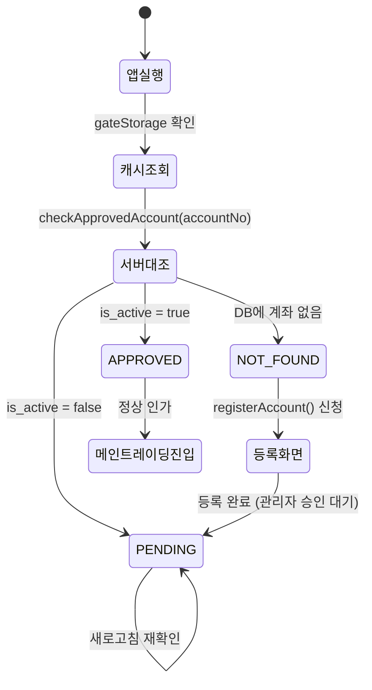

# 사용자게이트 — 스키마, 상태 머신 및 화면 (Schema & State & Screens)

## 1. Supabase 테이블 명세 (`schema.md`)

```sql
create table approved_users (
  id            uuid primary key default gen_random_uuid(),
  account_no    text not null unique,      -- 한국투자증권 종합계좌번호 앞 8자리
  is_active     boolean not null default false, -- 관리자 승인 플래그 (true여야 진입)
  created_at    timestamptz not null default now(),
  updated_at    timestamptz not null default now()
);
```

---

## 2. 상태 전이 다이어그램 (State Transition)



---

## 3. 화면 연동 (`screens.md`)

- **화면 진입점**:
  - `app/index.tsx`: 앱 구동 시 가장 먼저 실행되는 게이트 스크린 (계좌번호 입력 / 승인 대기 뷰 / 승인 통과 시 메인 대시보드 렌더링)
- **로컬 스토리지**:
  - `lib/gateStorage.ts`: 승인된 계좌번호 로컬 캐싱
