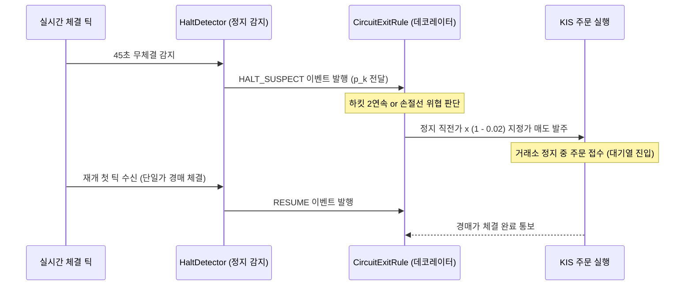

# 서킷 — 감지 원리 및 재개 매도 아키텍처 (Feature & Architecture)

## 1. 정지 감지 알고리즘

### A. 정지 의심 (`HALT_SUSPECT`) 판정
1. **무체결 시간 조건**: 마지막 체결 이후 경과 시간 $\ge 45$초 (`quietMs = 45,000`).
2. **사전 활발함 조건**: 마지막 체결 직전 3분(`activeWindowMs = 180,000`) 동안 체결 수 $\ge 30$건 (`minActiveTicks = 30`).
3. 위 두 조건을 동시 만족 시 `HALT_SUSPECT` 발화.

### B. 연속 정지 완화 조건 (`relaxAfterHaltMs`)
- 최초 정지 후 15분 이내에는 재개 후 체결이 단 1건만 발생하고 다시 45초 무체결이 발생해도 즉시 2차 정지로 인정.

---

## 2. 재개 단일가 매도 실행 흐름

