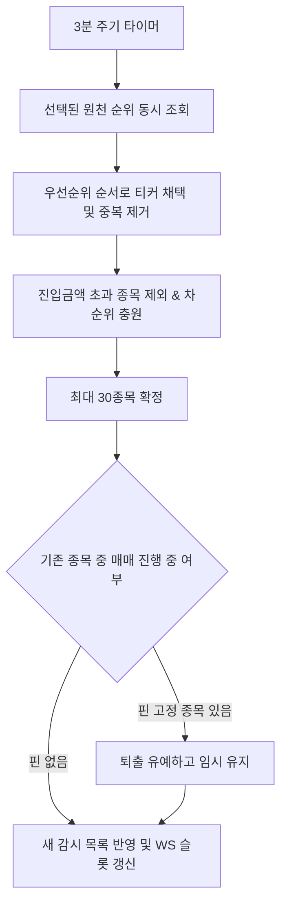

# 순위 — 기능, 소스 규격 및 UI 연동 (Feature & Sources & UI)

## 1. 지원 순위 원천 카탈로그 (`source-data.md`)

### A. 토스증권 (8개 조합)
- **지표**: 거래대금(`amount`), 거래량(`volume`)
- **기간**: 실시간(`realtime`), 1일(`1d`)
- **위험종목**: 미포함(`norisk`), 포함(`all`)
- *기본값*: 토스 거래대금(실시간, 위험미포함) 15개 + 토스 거래량(실시간, 위험미포함) 15개 = 총 30개

### B. 한국투자증권 (7개 종류)
- 거래량(`tradeVolume`), 거래량급증(`volumeSurge`), 가격급등(`priceFluct`), 거래증가율(`tradeGrowth`), 거래회전율(`tradeTurnover`), 매수체결강도(`volumePower`), 상승율(`upDownRate`)
- 기간창: 일 단위(`0`~`9`일) 또는 분 단위(`0`~`9`분) 선택 가능

---

## 2. 워치리스트 갱신 라이프사이클 (`feature.md`)

---

## 3. 트레이딩 리스트 UI 및 보유 종목 우선 노출

### A. 보유(관리 중) 종목 최우선 노출
- **정렬 원칙**: `보유(관리 중) 종목` > `미보유 종목`. 같은 그룹 내에서는 기존 틱속도(RPM) 내림차순 정렬을 유지합니다.
- **순위 탈락 시 합성 엔트리(Synthetic Entry)**: 보유 중인 종목이 순위 30위 밖으로 밀려나더라도 리스트에서 숨겨지지 않도록 합성 엔트리를 생성하여 트레이딩 리스트 최상단에 상시 노출합니다.

### B. 인라인 그리드 일체형 레이아웃
- 과거의 분리된 `그리드 관리` 패널을 제거하고, `트레이딩 리스트` 행 내부에서 가격, 틱속도, 진입/익절선 그리드가 원스톱으로 보이도록 통합했습니다.
- **보유 종목**: 수량, 손익률(pnl), 평단가, 익절선 게이지를 인라인으로 렌더링.
- **미보유 종목**: 평단/손익 칼럼을 숨겨 화면의 읽기 밀도를 높이고 감시 정보(현재가, 틱속도)에 집중.

---

## 4. 설정 화면 연동 (`screens.md`, `server-state.md`)

- **설정 컴포넌트**: `RankingSelectionPanel` (`features/scalper/ui/RankingSelectionPanel.tsx`)
- **저장 위치**: `lib/appSettings.ts` 내 `rankingSelection`
- **검증 규칙**: `validateRankingSelection` (선택된 개수 총합 $\le 30$)
