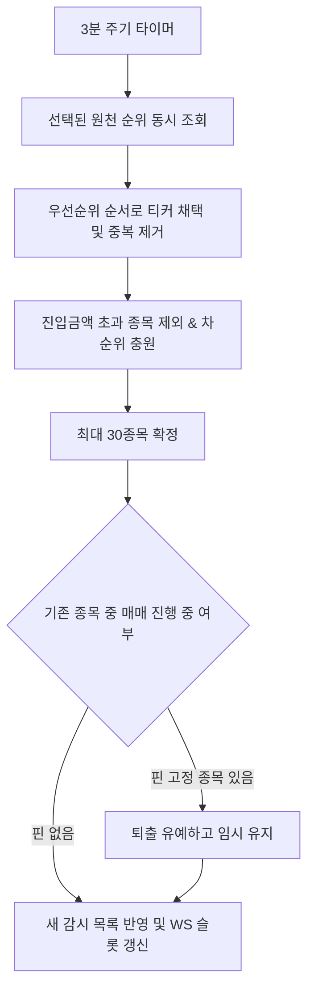

# 순위 — 기능, 소스 규격 및 UI 연동 (Feature & Sources & UI)

## 1. 지원 순위 원천 카탈로그 (`source-data.md`)

### A. 토스증권 (8개 조합)
- **지표**: 거래대금(`amount`), 거래량(`volume`)
- **기간**: 실시간(`realtime`), 1일(`1d`)
- **위험종목**: 미포함(`norisk`), 포함(`all`)
- *기본값*: 토스 거래대금(실시간, 위험미포함) 15개 + 토스 거래량(실시간, 위험미포함) 15개 = 총 30개

### B. 한국투자증권 (7개 종류)
- 거래량(`tradeVolume`), 거래량급증(`volumeSurge`), 가격급등(`priceFluct`), 거래증가율(`tradeGrowth`), 거래회전율(`tradeTurnover`), 매수체결강도(`volumePower`), 상승율(`upDownRate`)
- 기간창: 일 단위(`0`~`9`일) 또는 분 단위(`0`~`9`분) 선택 가능

---

## 2. 워치리스트 갱신 라이프사이클 (`feature.md`)

---

## 3. 설정 화면 연동 (`screens.md`, `server-state.md`)

- **설정 컴포넌트**: `RankingSelectionPanel` (`features/scalper/ui/RankingSelectionPanel.tsx`)
- **저장 위치**: `lib/appSettings.ts` 내 `rankingSelection`
- **검증 규칙**: `validateRankingSelection` (선택된 개수 총합 $\le 30$)
