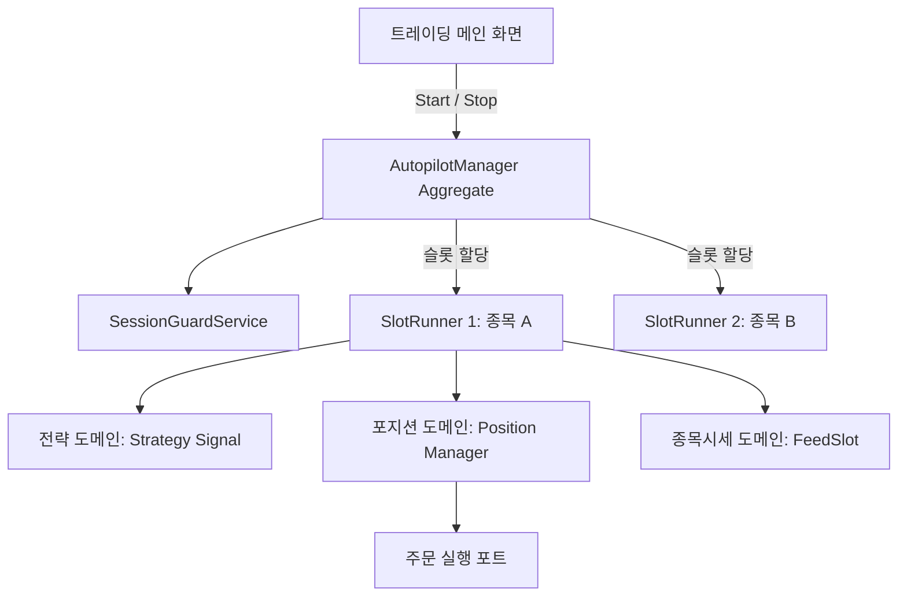
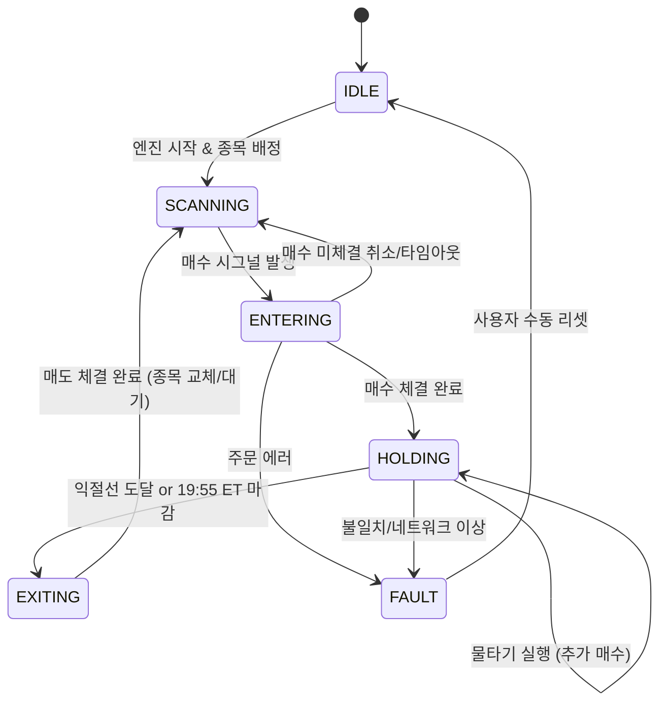

# 오토파일럿 — 아키텍처 (Architecture)

## 1. 컴포넌트 구조도

```mermaid
flowchart TB
    UI[트레이딩 메인 화면] -->|Start / Stop| APM[AutopilotManager Aggregate]
    APM --> SG[SessionGuardService]
    APM -->|슬롯 할당| SR1[SlotRunner 1: 종목 A]
    APM -->|슬롯 할당| SR2[SlotRunner 2: 종목 B]
    
    SR1 --> ST[전략 도메인: Strategy Signal]
    SR1 --> POS[포지션 도메인: Position Manager]
    SR1 --> WS[종목시세 도메인: FeedSlot]
    
    POS --> EX[주문 실행 포트]
```

## 2. 상태 머신 (State Machine)

```mermaid
stateDiagram-v2
    [*] --> IDLE
    IDLE --> SCANNING: 엔진 시작 & 종목 배정
    SCANNING --> ENTERING: 매수 시그널 발생
    ENTERING --> HOLDING: 매수 체결 완료
    ENTERING --> SCANNING: 매수 미체결 취소/타임아웃
    HOLDING --> HOLDING: 물타기 실행 (추가 매수)
    HOLDING --> EXITING: 익절선 도달 or 19:55 ET 마감
    EXITING --> SCANNING: 매도 체결 완료 (종목 교체/대기)
    
    ENTERING --> FAULT: 주문 에러
    HOLDING --> FAULT: 불일치/네트워크 이상
    FAULT --> IDLE: 사용자 수동 리셋
```
