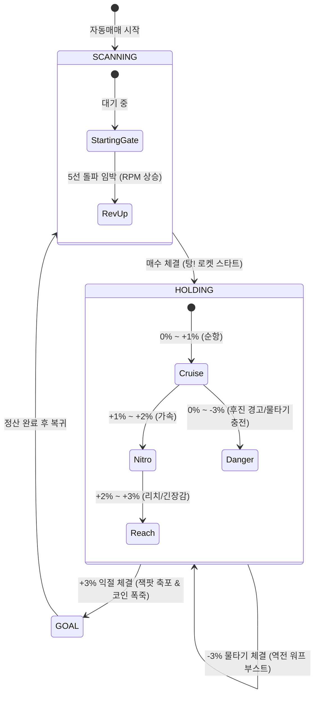

# 오토파일럿 실시간 레이스 트랙 (Live Race Stadium) 스펙

## 1. 개요
오토파일럿의 10~20분 대기 시간 및 시세 횡보 구간의 지루함을 해소하고, 매수 체결과 익절의 순간에 극적인 시각적 피드백과 재미를 선사하기 위한 **경마/레이싱(Live Race Track)** 메타포의 비주얼 기믹 명세이다.

---

## 2. 상태별 비주얼 라이프사이클

### 1) 대기(SCANNING) 상태: 스타팅 게이트 (Starting Gate)
- 보유 종목이 없을 때, 감시 상위 후보 종목들이 출발대(Gate)에서 정렬 대기.
- 실시간 틱/돌파 조건에 가까워질수록 게이트가 떨리며 RPM 바가 상승.
- 매수 체결 시 출발 총성과 함께 `GO! 🚀` 로켓 발진 연출.

### 2) 보유(HOLDING) 상태: 실시간 레이스 주행 (Race Lane)
- 출발선(평단가 0.0%)에서 결승선(목표가 +3.0%)까지 실시간 틱 비율에 따라 주자가 트랙을 주행.
- **Tension Zones**:
  - `Cruise (0% ~ +1%)`: 안정적인 주행 트레일.
  - `Nitro (+1% ~ +2%)`: 황금빛 니트로 화염 분사.
  - `Reach (+2% ~ +3%)`: 파칭코 '리치(Reach)' 모드 발동. 네온 오라, 테두리 번개, 심장박동 진동.
  - `Danger / Charge (-1% ~ -3%)`: 후진 위험 경고 및 '역전의 물타기 필살기 충전' 게이지 점등.

### 3) 체결 Climax 연출
- **익절 매도 (+3% GOAL)**:
  - 결승 테이프 절단 + 화면 전체 골드 코인 & 꽃가루(Confetti) 폭죽 + 축하 햅틱 진동.
- **물타기 체결 (-3% Scale-In)**:
  - '역전의 워프 부스터' 발동. 평단가 하향으로 결승선이 앞으로 확 당겨지는 역동적 스피드 연출.

---

## 3. 기술 원칙
1. **비침습성 (Non-invasive)**:
   - UI 렌더링 및 애니메이션은 `react-native-reanimated` 및 Native Driver로 구동되며, 고빈도 웹소켓 수신 및 발주 엔진의 스레드를 차단하지 않는다.
2. **원터치 토글**:
   - 사용자가 언제든 상단 토글 버튼을 통해 레이스 트랙 카드를 접거나 펼칠 수 있다.
3. **무음 모드 친화**:
   - 소리 없이도 시각 효과와 묵직한 진동(Haptics)만으로 충분한 몰입감을 제공한다.
