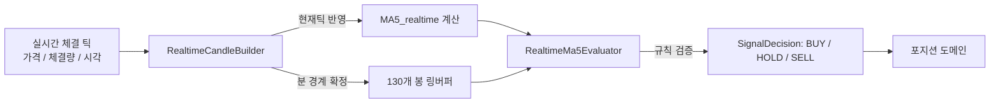

# 전략 — 기능 및 아키텍처 (Feature & Architecture)

## 1. 핵심 비즈니스 규칙 명세

### A. 실시간 MA5 계산식
- 확정된 최근 4개 1분봉 종가: $C_{-1}, C_{-2}, C_{-3}, C_{-4}$
- 현재 시각 틱 가격: $P_{current}$
$$MA5_{realtime} = \frac{C_{-1} + C_{-2} + C_{-3} + C_{-4} + P_{current}}{5}$$

### B. 기울기 상승(Slope Rising) 및 모멘텀 판정
- 실시간 가격 모멘텀: $P_{current} \ge P_{prev}$ (틱 단위 상승) 또는 $P_{current} \ge C_{-1}$ (직전 1분봉 종가 대비 상승)
- *(주의: 과거 $P_{current} > C_{-5}$는 5분 전 고점 종가와의 비교로 인해 바닥 반등 시 1~2분의 심각한 지연 및 고점 매수 버그를 유발하므로 돌파 필터로 사용하지 않음)*

### C. 상향 돌파(Upward Breakout) — 3초 하단 체류 상태 머신
- **문제 해결**: 5선 상단(예: 105)에서 하락 도중 5선(100) 부근에서 틱 진동(99.99 ↔ 100.01)이 0.1초 만에 발생하여 하락 칼날을 돌파로 오판하는 문제 차단.
- **하단 체류 조건**:
  - 가격이 5선 이하($P_{current} \le MA5_{realtime}$)에 진입한 시점부터 **최소 3초(3,000ms) 이상 연속으로 머물러야** 돌파 대기 상태(`isArmed = true`)로 전이.
  - 3초를 채우지 못한 상태에서 5선 위($P_{current} > MA5_{realtime}$)로 1틱이라도 상승 시 체류 타이머 즉시 리셋 (`belowStartMs = null`).
- **돌파 발화 조건**:
  - 돌파 대기(`isArmed === true`) 상태에서 직전 틱이 5선 이하이고 현재 틱이 5선을 초과하는 순간:
  $$P_{prev} \le MA5_{realtime} < P_{current}$$
  - 상향 돌파(`breakout = true`) 신호를 1회 발행하고 `isArmed` 상태를 즉시 소진(`false`).
  - 재돌파를 위해서는 다시 5선 아래에서 최소 3초 이상 연속 체류해야 함.

### D. 신호 발생 조건표

| 구분 | 조건 | 실행 결정 |
|---|---|---|
| **신규 진입** | 보유수량 = 0 ∧ 상향 돌파 ∧ 해당 분봉 미진입 | BUY 신호 발행, 평단×1.03 매도선 선등록 |
| **물타기** | 보유수량 > 0 ∧ `gapRate` $\le -3\%$ ∧ 상향 돌파 | BUY 추가 매수 신호 (수량 = 보유량 $\times (\vert gap \vert - 1)$) — 5분 지연 없이 돌파 즉시 실행 |
| **홀딩** | 위 조건 미충족 | HOLD |

---

## 2. 데이터 흐름 다이어그램

