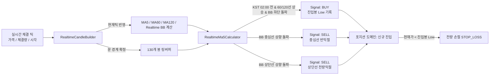

# 전략 — 기능 및 아키텍처 (Feature & Architecture)

## 1. 핵심 비즈니스 규칙 명세

### A. 실시간 이동평균선(MA5, MA60, MA120) 및 실시간 볼린저 밴드(Realtime BB) 계산식
- 확정된 최근 119개 1분봉 종가: $C_{-1}, C_{-2}, \dots, C_{-119}$
- 현재 시각 틱 가격: $P_{current}$
- **실시간 MA5**:
$$MA5_{realtime} = \frac{C_{-1} + C_{-2} + C_{-3} + C_{-4} + P_{current}}{5}$$
- **실시간 MA60 및 상승 판정**:
$$MA60_{realtime} = \frac{\sum_{i=1}^{59} C_{-i} + P_{current}}{60}$$
  - 상승 조건(`ma60Up`): $MA60_{realtime} > MA60_{[-1]}$ (동치: $P_{current} > C_{-60}$) ∧ 확정봉 기준 $SMA60_{[-1]} > SMA60_{[-2]}$
- **실시간 MA120 및 상승 판정**:
$$MA120_{realtime} = \frac{\sum_{i=1}^{119} C_{-i} + P_{current}}{120}$$
  - 상승 조건(`ma120Up`): $MA120_{realtime} > MA120_{[-1]}$ (동치: $P_{current} > C_{-120}$) ∧ 확정봉 기준 $SMA120_{[-1]} > SMA120_{[-2]}$
- **실시간 볼린저 밴드 (20분봉, 2σ)**:
  - 20개 합성 표본: $X = [C_{-19}, C_{-18}, \dots, C_{-1}, P_{current}]$
  - 중심선: $MA20_{realtime} = \frac{1}{20}\sum_{i=1}^{20} X_i$
  - 분산: $\sigma^2 = \frac{1}{20}\sum_{i=1}^{20} (X_i - MA20_{realtime})^2$
  - 표준편차: $\sigma = \sqrt{\sigma^2}$
  - **실시간 볼린저 하단선**: $lowerBb = MA20_{realtime} - 2\sigma$
  - **실시간 볼린저 상단선**: $upperBb = MA20_{realtime} + 2\sigma$

### B. 볼린저 하단선 상향 돌파 (분할 매수 트리거)
- 급락 후 바닥을 충분히 다진 뒤 볼린저 하단선을 뚫고 올라오는 강한 반등 추세 포착.
- **1단계: 하단 3초 체류 (`belowDwellOk = true`)**:
  - $P_{current} \le lowerBb$: 하단 체류 시작 기록 (`belowStartMs`). 연속 3초(3,000ms) 이상 체류 시 확정.
  - $P_{current} > lowerBb$: 1초(1,000ms) 이상 머물러야 이탈 리셋 (1초 미만 일시적 튐은 잔파동으로 무시).
- **2단계: 상단 3초 체류 (`isArmed = true`)**:
  - 하단 체류 충족 후 $P_{current} > lowerBb$로 올라와 3초 이상 체류 시 `isArmed = true`.
  - $P_{current} \le lowerBb$로 일시 밀림 시 1초 이상 머물러야 리셋.
- **3단계: 돌파 발화**:
  - `isArmed === true` 도달 시 1회 발화(`breakout = true`) 후 상태 즉시 소진.

### C. 볼린저 중심선(MA20) 및 상단선 상향 돌파 (익절 트리거)
- **1단계: 볼린저 중심선(MA20) 상향 돌파 (반익절 `middleCross`)**:
  - $P_{prev} < MA20_{realtime} \land P_{current} \ge MA20_{realtime}$: 중심선 상향 돌파 감지 시 1회 SELL 신호 발화.
  - 포지션에서 보유 수량의 절반(수량이 1이면 전량)을 익절 매도.
- **2단계: 볼린저 상단선 상향 돌파 (전량 익절 `upperBreakout`)**:
  - $P_{prev} < upperBb \land P_{current} \ge upperBb$: 상단선 상향 돌파 감지 시 1회 SELL 신호 발화.
  - 포지션에서 남은 잔여 수량 전량을 익절 매도하여 사이클 정산 완료.

### D. 진입봉 저점 손절 트리거
- 진입 시점의 1분봉 최저가($Low_{entry}$)를 메모리에 보관.
- 보유 중 $P_{current} < Low_{entry}$ 하향 이탈 발생 시 지체 없이 전량 손절(`STOP_LOSS`) 집행.

### E. 신호 발생 조건표 (BB 반등 진입 · 중심선 반익절 · 상단선 전량익절)

| 구분 | 전제 조건 및 트리거 | 실행 결정 |
|---|---|---|
| **신규 진입** | 보유수량 = 0 ∧ **한국시간 02:00 전** ∧ **60선·120선 동시 상승** ∧ 실시간 BB 하단선 돌파 (`breakout = true`) ∧ 해당 분봉 미진입 | BUY 신호 (수량 = 설정 1배수 `orderQty` 또는 설정금액) |
| **추가진입 (물타기)** | 보유수량 > 0 | **전면 봉인 (추가진입 없음)** |
| **중심선 반익절** | 보유수량 > 0 ∧ 실시간 BB 중심선 상향 돌파 (`middleCross = true`) (1회 한정) | SELL 신호 (수량 = 1주면 전량, 2주 이상이면 $\lfloor qty / 2 \rfloor$) |
| **상단선 전량익절** | 보유수량 > 0 ∧ 실시간 BB 상단선 상향 돌파 (`upperBreakout = true`) | SELL 신호 (잔여 전량 익절 매도) |
| **저점 손절** | 보유수량 > 0 ∧ 현재가 < 진입봉 저점 ($P_{current} < Low_{entry}$) | 전량 손절 (`STOP_LOSS`) |
| **홀딩** | 위 조건 미충족 | HOLD |

---

## 2. 데이터 흐름 다이어그램

