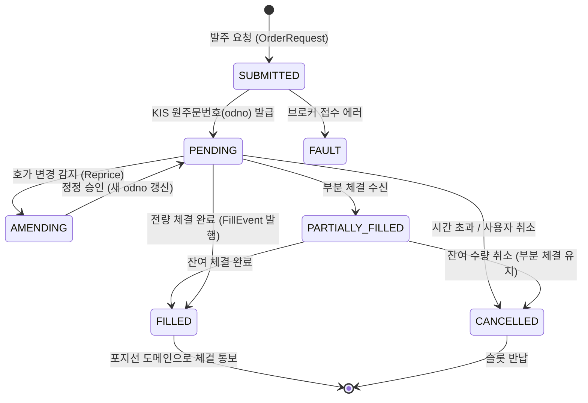

# 주문 — 주문 라이프사이클 및 체결 수신 (Feature & Architecture)

## 1. 주문 상태 머신 (State Machine)

---

## 2. 실시간 체결 수신 및 이벤트 디스패치 (`source-data.md`)

- **원천 스트림**:
  - KIS 실시간 해외주식 체결통보 WebSocket (`H0GSCNT0` / `HDFSASP0`)
  - 2초 주기 `refreshFills` 주문체결내역 REST 폴링 (웹소켓 유실 대비 폴백)
- **발행 이벤트 (`OrderFilledEvent`)**:
  - 매수 체결 $\to$ **[포지션 도메인]**: `HOLDING` 포지션 생성 또는 평단 갱신 + 익절 매도(+3%) 주문 요청
  - 매도 체결 $\to$ **[포지션 도메인]**: 포지션 소멸 및 **[성과분석 도메인]**: 거래 결과 정산/기록
