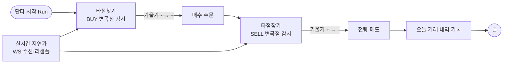

# PRD: 변곡점 단타 모바일 앱 (Expo) — financial-app

> 작성일: 2026-07-29 · 상태: **초안** (미확정 항목 §9 확인 후 확정)
> 원천: 사용자↔AI 대화 축약본 2건 (① Electron+RN 모노레포 스캘퍼 개요, ② Expo 변곡점 앱 명세). **이 PRD의 정본은 ②**이며, ①은 배경 지식·KIS 검증 항목·리스크 파라미터의 출처로만 흡수한다.
> 참고 구현: `c:\Users\user\repositories\my\bitcoin-simulation-app` (Expo 54 + expo-router + NativeWind + Supabase + expo-updates — 스택 선례로만 참고, 코드 재사용 아님)
> 관련 프로젝트: `financial/`(웹판 눌림목 엔진), `financial-desktop/`(Tauri 설계) — 전략·코드 모두 별개. 이 앱은 변곡점(미분) 전략의 독립 구현이다.

## 1. 한 줄 정의

한국투자증권(KIS) Open API로 실시간 체결가를 받아, Savitzky-Golay 필터의 1차/2차 미분으로 **변곡점(기울기 부호 전환)**을 감지해 자동 매수·청산하는 **React Native(Expo) 단독 앱**. 서버 없음, 각 앱이 KIS에 직접 연결.

## 2. 핵심 철학 (임의 단순화 금지)

- 승률 100%가 아니라 **손익비 관점의 손실 최소화·계좌 보호**가 목적.
- **매수(진입)**: 상승 변곡점 — 기울기 `-` → `+` 전환 감지 시 진입.
- **매도(청산)**: 고점 변곡점 — 기울기 `+` → `-` 전환 감지 시 청산 (수익이든 손실이든). 단, **매도 모멘텀 확인 단계**(§4-C-3, 2026-07-31 개정)로 얕은 눌림은 잠깐 지켜보다 하락에 힘이 실릴 때 판다(만료 6초 시 무조건 매도·급락 시 즉시 매도).
- **고정 손절·익절 없음 (사용자 확정 2026-07-29)**: %손절선·고정 익절·시간 손절을 두지 않는다. 진입도 청산도 **오로지 변곡점 신호로만** 실행하며, 하락 방어는 고점 변곡점 청산이 담당한다.
- (선택) 기울기는 양수인데 2차 미분(가속도)이 급격한 음수로 꺾이면 UI 선제 경고 — 주문은 나가지 않음, 기본 off.
- **수수료·슬리피지 고려**: 틱 단위 매매 지양. 노이즈를 제거한 **1~3분 단위의 큰 변곡점 파동**만 추적.

## 3. 시스템 구성

```
┌─ Expo 앱 (단독 동작, 서버 없음) ─────────────────────────┐
│  접근 제어: Supabase approved_users (계좌번호 화이트리스트) │
│  데이터: KIS WebSocket 실시간 체결가 ──▶ 3초 청크 평균     │
│          ──▶ 원형 버퍼(31~51개) ──▶ SG 1차/2차 미분       │
│          ──▶ 변곡점 판정 ──▶ KIS REST 주문(매수/청산)      │
│  저장: 앱키·시크릿·계좌·손절비율 = 기기 보안 저장소         │
└──────────────────────────────────────────────────────────┘
```

- **Backend 없음** (Serverless). Supabase는 접근 제어 조회 전용, 시세·주문 중계 안 함.
- **실전(live, 실계좌) 전용**. ~~모의투자(paper) 전환 옵션~~은 2026-07-30 제거 — KIS 해외주식은 웹소켓 시세·현재가·순위가 모의 미지원이라(§7-3) PAPER는 동작 불가였고, 스위치 오조작이 모의 도메인 호출 오류를 유발해 옵션 자체를 없앴다. 검증·리허설은 실계좌 소액.

## 4. 기능 명세

### A. Supabase 접근 제어

1. 앱 실행 → KIS 로그인 시 입력받은 **계좌번호**를 Supabase `approved_users` 테이블에서 조회.
2. `is_active = true`인 계좌만 메인 화면·매매 기능 진입 허용.
3. 미등록 계좌: `"등록되지 않은 계좌예요. 개발자에게 연락해 주세요."` 팝업 후 진입 차단.
4. 테이블 스키마(안): `approved_users(account_no text pk, is_active bool, memo text, created_at)`. 앱은 **읽기 전용** — RLS로 select만 허용, 쓰기는 개발자가 Supabase 대시보드에서.

### B. 실시간 데이터 처리 & 리샘플링

1. WebSocket 틱(초당 수십 건)을 **직접 연산하지 않는다**.
2. **Time-Chunking**: 3초(가변) 동안 수신된 체결가 평균 → 대표 데이터 1개.
3. **Circular Buffer**: 최근 31~51개(가변, 홀수 유지 — SG 윈도 요건)의 리샘플 데이터를 고정 크기 버퍼로 유지.
4. 버퍼가 창 크기만큼 차기 전에는 신호 판정 금지(워밍업 상태 표시).

### C. 변곡점 감지 알고리즘 (`TrendDetector`)

1. `ml-savitzky-golay`로 버퍼의 **1차 미분(기울기)·2차 미분(가속도)**을 매 리샘플마다 계산.
2. **BUY**: 이전 기울기 < 0 && 현재 기울기 ≥ 0.
   - **매수 모멘텀 확인 단계(2026-07-31 사용자 확정)**: 전환(-→+) 감지 시 즉시 매수하지 않고 "모멘텀 확인 대기"로 들어가, 이후 청크마다 **상대 기울기(SG 1차 미분 ÷ 버퍼 마지막 가격, 단위 %/청크) ≥ 문턱**일 때에만 진입한다. 문턱 기본 **0.01%/청크**(설정 가능, `momentumThresholdPct`). `confirmWindowChunks`(기본 5) 안에 문턱 미달이거나 기울기가 다시 음수가 되면 대기를 폐기하고 전환 감지로 복귀한다(재전환 시 다시 대기 진입). **문턱 0이면 끔** — 전환 즉시 매수(기존 동작·하위호환). 상대 기울기라 가격 규모($2/$300)와 무관하게 판정된다.
3. **SELL**: 이전 기울기 > 0 && 현재 기울기 ≤ 0. **변곡점 외 청산 트리거는 없다** (%손절·시간 손절 없음).
   - **매도 모멘텀 확인 단계(2026-07-31 사용자 확정 — 수익 극대화 사유)**: 기존의 "전환 즉시 매도"를 **약한 매도 필터**로 개정한다. 배경은 실사례 — 0.439 매수 → 0.437 얕은 눌림에서 기울기가 0을 잠깐 하향 통과했다는 이유만으로 즉시 청산돼, 이후 0.99까지의 추세를 놓쳤다. 규정:
     1. +→- 전환 감지 시 즉시 팔지 않고 "매도 확인 대기"로 들어간다.
     2. 이후 매 청크 **하락 상대 기울기 크기 ≥ 매도 문턱**(기본 **0.005%/청크**, 설정 `sellMomentumThresholdPct`)이면 SELL 발동.
     3. 대기 중 기울기가 다시 **+로 회복**하면 매도를 폐기하고 계속 홀딩한다(핵심 구제 경로 — 얕은 눌림 홀딩).
     4. **대기 한도(`sellConfirmWindowChunks`, 기본 2청크 = 6초) 만료 시 무조건 SELL** — ⚠ 매수(만료 시 폐기)와 반대다. 매도는 지연 상한이 6초일 뿐 반드시 실행돼 방어선을 보존한다.
     5. **급락 예외**: 대기 중이라도 상대 가속도(SG 2차 미분 ÷ 가격)가 급락 임계(`crashAccelThreshold`, 기본 **-2%/청크²** = -0.02) 이하로 붕괴하면 대기를 무시하고 즉시 SELL한다. 임계 근거 — 평범한 둥근 정점·완만한 하락의 상대 가속도는 최악 약 -0.008/청크²에 그치는 반면 진짜 폭락은 -0.013을 넘어 깊어진다(합성 시나리오 캘리브레이션). 기본값은 그 약 2.5배 아래라 일상적 되돌림엔 잠자코 있고 진짜 붕괴에서만 발동한다(보수적). 만료 매도(6초)라는 방어선이 이미 있어 임계를 다소 보수적으로 잡아도 손실 노출은 최대 6초로 제한된다.
     6. **문턱 0이면 끔** — 전환 즉시 매도(기존 동작·하위호환·A/B). 매수 모멘텀 확인과 상태가 완전히 독립이다(reset 포함).
4. (선택) 가속도 급락 시 선제 경고 이벤트 (주문은 안 나가고 UI 경고만 — 기본 off).
5. 순수 함수/클래스로 구현해 **과거 틱 배열 재생 단위 테스트** 가능해야 함 (돈이 걸린 로직).
6. 포지션 상태기계: `IDLE → ENTERED → EXITED`. 청산 트리거는 SELL 변곡점 단일.

### D. 주문 실행

1. BUY 신호 → KIS 해외주식 매수 주문(REST). SELL 신호 → 전량 매도.
2. **TR_ID 미설정 시 주문이 아예 나가지 않는 안전장치** (①의 orderExecutor 원칙 계승).
3. 1포지션 원칙(**인스턴스당**): 인스턴스가 보유 중이면 추가 매수 없음, 청산 완료 후에만 재진입. 인스턴스는 티커별로 여러 개 가능(§4-E 단타 탭, 상한 기본 3).
4. **미체결 정책 (2026-07-30 폐기 → 2026-08-06 매수 한정 재도입)**
   - **폐기 이력(보존)**: ~~일정 시간 미체결 시 자동취소 후 재대기~~ → 실기기에서 취소 API 거절+미체결 잔존 오작동이 반복돼 자동취소를 폐기했다. 근본 원인은 "취소가 실패할 수 있는데 결과를 확인하지 않고 상태를 되돌린 것"이고, 그 결과 실계좌 중복 매수 3건·매도 미실행이 났다.
   - **재도입 조건(매수만)**: 설정 `buyCancelAfterSec`(기본 0=끔)을 켰을 때만 동작한다. 되돌리는 경로에 증거 3겹을 요구한다 — ① 취소 확정(`cancelState === 'confirmed'`) ② 취소 확정 **후 체결내역 재조회**로 0주 재확인 ③ **부분체결이면 취소 자체를 걸지 않는다**. 하나라도 불충족이면 되돌리지 않고 기존 무한 대기에 머문다(fail-closed). 취소 거절은 유예 3폴 뒤에도 불명일 때만 FAULT. 연속 3회 취소 시 그 종목은 60초 쉰다.
   - **불변**: 매도는 여전히 무한 대기이며 Stop 경로에서도 취소하지 않는다(매수1호가 추종 정정으로 따라간다). FAULT 인터록도 그대로다.
   - **그때는 없던 안전장치**: `CancelState` 계약, ODNO 10자리 0패딩(`normalizeOdno`), 매수 프리플라이트, 체결확인 실패 시 poll 차단.
   - **체결 확인 방식**: 주문 후 **주문체결내역 REST 폴링**(수 초 간격)으로 판정 — v1 기본. 해외주식 실시간체결통보 WS(H0GSCNI0, 원문 확보됨·모의 H0GSCNI9 지원)는 폴링 지연이 문제로 확인되면 도입하는 업그레이드 옵션.
5. **티커 지정 동선**: 조회 탭의 순위 목록(§4-E — 거래량·급등락·체결강도 등 6종)에서 종목을 탭해 단타 인스턴스에 프리필하는 것이 기본 동선. 직접 입력도 가능. 자동 선정은 하지 않는다 — 선택은 항상 사용자.

### E. 화면 설계 (RN — 데스크톱 카드 스케치의 모바일 변환)

> 원천: 사용자 카드 스케치(2026-07-29 대화, 데스크톱 그리드 기준). 데스크톱의 카드 7종을 모바일 관용구에 맞춰 **게이트 + 하단 탭 3개**로 재배치한다. 카드 가로 나열 → 세로 스택/세그먼트.

```
게이트(미등록 계좌 차단)
   │ 통과
   ▼
┌──────────────────────────────┐
│  [단타]     [조회]     [설정]  │   ← 하단 탭 (expo-router tabs)
└──────────────────────────────┘

[단타 탭]              [조회 탭]                  [설정 탭]
┌──────────────┐  ┌──────────────────┐  ┌──────────────┐
│ 단타 AAPL     │  │ 보유│미체결│거래량│오늘 │  │ 계좌번호      │
│ LIVE 상태배지 │  │      (세그먼트)     │  │ 앱 키        │
│ 티커 / 수량   │  ├──────────────────┤  │ 시크릿 키     │
│ 현재가·기울기·│  │ A  AAPL 애플  1  1 │  │ [토큰 발급]   │
│ 가속도·수익률 │  │ …                 │  │ 만료 배지     │
│ [ Run/Stop ] │  │ (당겨서 새로고침)   │  │ 주문 수량     │
├──────────────┤  └──────────────────┘  │ 청크 초·버퍼  │
│ + 추가 (점선) │                         │ LIVE/PAPER   │
└──────────────┘                         └──────────────┘
```

| 화면 | 데스크톱 스케치 대응 | 내용 |
|---|---|---|
| 게이트 | — | 계좌번호 입력 → Supabase `approved_users` 검증 → 차단/통과 (§4-A) |
| 단타 탭 | "short-term trading" 카드 + "+ add" 점선 카드 | 인스턴스 카드 멀티(상한 기본 3 — KIS WS 등록 상한·폰 리소스 고려). 카드: 티커·수량 입력, Run/Stop, 상태 배지(IDLE/ENTERED/EXITED), 현재가·기울기·가속도·수익률, 최근 신호. + 추가로 카드 증설 |
| 조회 탭 | 보유종목·미체결 내역·거래량 상위·오늘 거래 내역 카드 4종 | 세그먼트 4개로 통합. 보유종목=잔고 API, 미체결=주문체결내역(미체결 필터, 행에 [취소]), **순위**=KIS 순위 API 6종(거래량순위·거래량급증·가격급등락·거래증가율·거래회전율·매수체결강도 — 원문 확보 완료, 종류 선택 드롭다운) → **행 탭 = 단타 인스턴스 티커 프리필(티커 지정의 기본 동선)**, 오늘 거래 내역=주문체결내역(당일)+앱 자체 기록. 데스크톱의 [리프레시] 버튼 → **당겨서 새로고침**, "run" 버튼 → 조회 실행 |
| 설정 탭 | "계좌" 카드 | AppKey·AppSecret·계좌번호 입력, [토큰 발급]+만료 배지, 주문 수량·청크 초·버퍼 크기, LIVE/PAPER 전환. expo-secure-store 저장 |

- **성능**: 웹소켓·연산은 `useRef`/비 상태 경로로 처리, **신호 발생·상태 전이 시에만 setState** — 매 틱 리렌더 금지 (배터리·메모리). 단타 구동 중 **keep-awake 기본 ON** — 화면 항시 켜짐이 운영 전제(§9 확정).
- UI 문구는 해요체(토스 스타일), 화려함보다 정보 밀도.

### F. Run 사이클 (사용자 플로우 그림의 정식화)

> 원천: 사용자 플로우 그림(2026-07-29 대화). 그림의 "조건부 매도 +3% / -1.5%"는 §2 확정(변곡점 단일 트리거)보다 먼저 그려진 것이라 **SELL 변곡점으로 대체**했다.



- **1 Run = 1사이클 (사용자 확정 2026-07-29)**: Run 1회 = 매수 → 청산까지 한 사이클을 돌고 종료(그림의 "끝"). 자동 재진입 없음, 다음 사이클은 사용자가 다시 Run. Stop은 어느 단계에서든 가능 — 포지션 보유 중이면 전량 매도 후 종료.
- **미체결 루프**: **매수** 주문이 설정한 시간 안에 안 붙으면(설정을 켰을 때) 취소 후 직전 "타점찾기" 상자로 복귀해 변곡점을 다시 기다린다. 부분체결이면 취소하지 않는다. **매도는 취소 없이 무한 대기**하며 매수1호가를 따라 정정한다 (§4-D-4).
- "오늘 거래 내역 기록"은 로컬 기록(진입·청산 가격, 손익, 신호 스냅샷) 저장 → 조회 탭 "오늘 거래 내역"에 반영.

## 5. 매매 파라미터 (.env/설정으로 조정 가능)

| 항목 | 기본값 | 비고 |
|---|---|---|
| 리샘플 청크 | 3초 | 가변 |
| SG 버퍼 크기 | 31~51 (홀수) | 가변 |
| 주문 수량 | 설정값 | 고정 수량 |
| 매수 모멘텀 문턱 | 0.01 %/청크 | 가변 (`momentumThresholdPct`, 0이면 끔 — 전환 즉시 매수) |
| 매도 모멘텀 문턱 | 0.005 %/청크 | 가변 (`sellMomentumThresholdPct`, 0이면 끔 — 전환 즉시 매도). 만료(기본 2청크=6초) 시 무조건 매도·급락 시 즉시 매도 (§4-C-3, 2026-07-31 확정) |
| 매도 확인 대기 한도 | 2청크 (6초) | detector 상수 `sellConfirmWindowChunks` — 만료 시 무조건 매도 |
| 급락 예외 임계 | -2 %/청크² | detector 상수 `crashAccelThreshold` — 상대 가속도 이하로 붕괴 시 대기 무시 즉시 매도 |

- **고정 손절·익절·최대 보유시간 없음** (사용자 확정 2026-07-29) — 청산은 SELL 변곡점 단일 트리거. ①의 +4%/-2.5%/600초, ②의 -1.5% 즉시 손절 조항은 모두 폐기.
- 수용한 트레이드오프: 3초 리샘플 + SG 평활로 변곡점 감지에는 지연이 있어, 급락 시 변곡점 확인 전까지의 하락폭은 방어 장치 없이 그대로 노출된다 (실계좌 소액·최소 수량 전제).

## 6. 기술 스택

| 영역 | 선택 | 근거 |
|---|---|---|
| 앱 | **React Native + Expo** (TypeScript) | 본인·소수 승인자용, Expo Go QR 실행(개발자 계정 불필요), `eas update` 무선 배포 |
| 라우팅/스타일 | expo-router + NativeWind | bitcoin-simulation-app에서 검증된 구성 |
| WebSocket | RN 내장 `WebSocket` 전역 객체 | 별도 ws 패키지 불필요 |
| 수학 | `ml-savitzky-golay` | 노이즈 제거 + 1차/2차 미분 |
| 접근 제어 | `@supabase/supabase-js` (무료 플랜) | 계좌번호 화이트리스트 |
| 키 저장 | **expo-secure-store** | 평문 저장 금지. Expo Go에서 동작(react-native-encrypted-storage는 네이티브 모듈이라 Expo Go 불가) |
| 코드 보안 | **보류** | 난독화는 정식 출시(APK 빌드) 시 재검토 (§9 확정). Expo Go 실행에는 해당 없음 |

## 7. ⚠️ 실전 투입 전 KIS 검증 필수 항목 (①에서 계승 — 미검증 시 실전 계좌 연결 금지)

1. **실시간체결가(HDFSCNT0) 필드 순서** — 틀리면 에러 없이 조용히 잘못된 가격으로 계산되는 최악의 버그. 원본 필드 덤프 모드(`RAW_FIELD_DEBUG`류)를 만들어 공식 문서와 대조.
2. **해외주식 매수/매도 TR_ID** (실전/모의 상이) — 미설정 시 주문 차단 안전장치 필수.
3. **모의투자(vps) 웹소켓 포트/URL** — financial 프로젝트 경험상 **웹소켓 시세는 모의 미지원이라 실전 도메인 우회**했음(모의 매도 TR은 VTTT1001U). 동일한지 재확인.
4. **"지연 체결가" 실지연 여부** — 스캘핑 특성상 지연폭 사전 실측 필수. 지연이면 손절 라인 이탈 폭이 커진다.

## 8. 하지 않는 것

- ❌ **Electron 데스크톱 / 모노레포 packages/core** — ①의 구상이지만 이번 범위 아님 (별도 프로젝트 `financial-desktop`이 데스크톱 축을 담당)
- ❌ **VWAP·체결강도·ABCD 스코어링 전략** — ①의 전략. 이 앱은 변곡점(미분) 전략 단독. 병합은 v2 검토 (§9)
- ❌ 중앙 서버·상태 중계 — 각 클라이언트가 KIS 직접 연결
- ❌ 자동 종목 선정/추천 — 순위 API 6종으로 **후보 목록을 보여주는 것까지만**, 종목 선택은 항상 사용자 (§4-D-5)
- ❌ 차트 라이브러리 풀 캔들차트 — v1은 숫자·간단 라인(필요 시)까지만
- ❌ 백그라운드(화면 꺼짐) 자동매매 — Expo 백그라운드 실행 불가. v1은 **화면 항시 켜짐** 전제(keep-awake 기본 ON), 백그라운드는 정식 출시 시 재검토 (§9 확정)

## 9. 결정 사항 (확정 기록)

**전부 확정됨 (2026-07-29):**

| # | 항목 | 확정 내용 |
|---|---|---|
| 1 | 대상 지정 | **미국 해외주식.** 티커는 KIS 순위 API 7종(거래량순위·거래량급증·가격급등락·거래증가율·거래회전율·매수체결강도·상승율/하락율 — 마지막은 2026-08-03 추가) 조회 결과 **순위 종목 중에서 사용자가 선택**하는 것이 기본 동선 (§4-D-5·§4-E). 자동 선정 없음 |
| 2 | 주문 방식 | **자동 주문.** Run 1회 = 매수 → 청산 한 사이클 완주 후 종료 (§4-F) |
| 3 | 미체결 정책 | **매수**: N초 미체결 → 취소 → 감시 복귀 (2026-08-06 재도입, 설정 기본 끔·부분체결 제외·연속 3회 시 60초 쿨다운). **매도**: 무한 대기 + 매수1호가 추종 정정 (§4-D-4) |
| 4 | 난독화 | **보류** — 앱 정식 출시 시 재검토 |
| 5 | 화면/백그라운드 | **화면 항시 켜짐 전제** (Expo는 백그라운드 실행 불가). keep-awake 기본 ON. 백그라운드 지원은 정식 출시 시 재검토 |
| 6 | 앱 기본 모드 | **실전(실계좌) 전용** — 2026-07-30 모의 전환 옵션 자체를 제거(스위치 오조작으로 모의 도메인 호출 사고 발생 + KIS 모의는 시세·순위 미지원이라 동작 불가). 검증·리허설도 실계좌 소액 |
| 7 | 청산 규칙 | **손절·익절·시간 손절 없음** — 진입·청산 모두 변곡점 신호 단일 트리거 (§2·§5) |

**추후(정식 출시 시) 재검토 목록**: 코드 난독화(APK 빌드), 백그라운드 실행.

## 10. 성공 기준 (v1)

1. 실계좌(소액·최소 수량)에서 **진입 → 청산 1사이클 자동 완료**가 앱 로그·KIS 체결내역으로 확인된다.
2. 미등록 계좌는 메인 화면에 진입할 수 없다.
3. 과거 틱 재생 테스트에서 BUY/SELL 변곡점 판정이 전부 green.
4. 30분 구동 중 매 틱 리렌더 없이(신호 시에만 UI 갱신) 앱이 버벅이지 않는다.
5. KIS 검증 4항목(§7)이 체크리스트로 완료 표시되어 있다.
