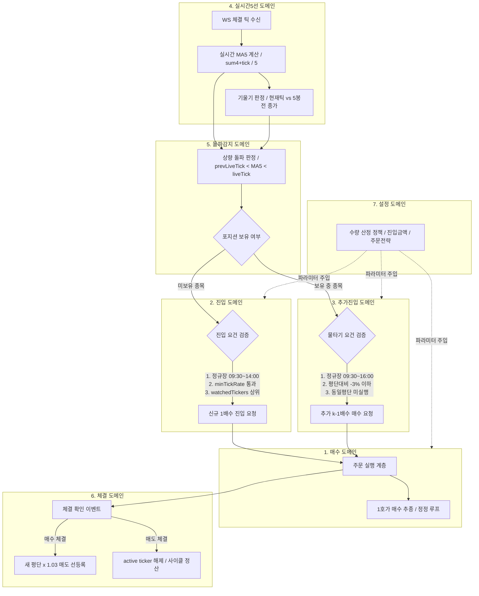

# 실시간 5선 단타 자동매매 7대 도메인 정의서

> **문서 버전**: 1.0.0  
> **적용 전략**: 실시간 MA5 돌파 + -3% 물타기 단일 전략 (Single Strategy Architecture)  
> **문서 성격**: 자동매매 책임 분리 및 불변식(Invariants) 규정 정본  
> **위치**: `docs/trading-domain/` (기존 `docs/domain`과 분리된 트레이딩 도메인 전용 문서)

---

## 1. 개요 및 배경

본 문서는 실시간 5선(MA5) 돌파 감지 및 평단 대비 -3% 물타기 단타 자동매매 시스템의 **7개 도메인 책임 경계**와 **거래 규칙**을 정의합니다.

### 1.1 최근 발견된 3대 장애 요인 및 해결 조치
실제 운영 환경에서 관측된 아래 3가지 문제점을 해결하기 위해 도메인 규칙을 정정·고정하였습니다:

1. **시작 즉시 오진입 (돌파 오판정 버그)**
   - **문제**: 자동 트레이딩 시작 직후 틱속도나 돌파 조건 없이 즉시 종목이 매수됨.
   - **근본 원인**: 과거 분봉 시드(Seed Probe)가 계산기의 `prevTick`을 과거 종가로 오염시켜, 시작 후 첫 번째 라이브 틱 수신 시 `과거종가 < MA5 < 현재틱`으로 오판단되어 가짜 상향 돌파가 발화됨. 또한 속도 필터(`minTickRate`)와 감시 후보(`watchedTickers`) 검증이 면제되어 있었음.
   - **해결**: 시드 프로브와 라이브 틱 판정을 엄격히 분리(최소 2회 이상 라이브 틱 관측 후 크로스오버만 인정)하고, 속도 필터 및 감시 후보 게이트를 필수 적용.

2. **주간거래 스프레드 손실 (-2%) 및 장마감 직전 진입 리스크**
   - **문제**: 주간거래(Blue Ocean ATS) 시간대에 1호가 매수로 진입하여 즉시 -2% 손실 기록, 장마감 직전 진입 시 오버나잇 위험.
   - **해결**: 
     - **[신규 진입]**: **미국 정규장(ET 09:30 ~ 16:00, 월~금) 중 장마감 2시간 전인 ET 09:30 ~ 14:00에만 허용**. 주간거래(ATS), 프리마켓, 애프터마켓 및 14:00 이후 신규 진입 원천 금지.
     - **[추가진입 (물타기)]**: 정규장 시간(ET 09:30 ~ 16:00) 내내 언제든 허용 (장마감 2시간 전인 ET 14:00 ~ 16:00 사이에도 기존 보유 종목의 평단 대비 -3% 물타기는 정상 허용).

3. **매수 종목 0틱 방치 및 감지 부재 의혹**
   - **문제**: 매수한 종목이 리스트에서 0틱/분으로 표시되어 감지에서 제외된 것처럼 보임.
   - **근본 원인**: 주간거래 세션에서 해당 종목의 거래 체결이 0건이어서 10초 롤링 윈도우 틱속도가 0으로 떨어진 것임. (시스템 내에서는 Pinned 및 TickHolds로 WS 구독이 정상 유지됨).
   - **해결**: 주간거래 진입 차단으로 저유동성 함정을 원천 방지하고, WS 틱 끊김 시 REST 시세 폴백(`fetchRestPrice`) 연동을 보장.

---

## 2. 7대 도메인 구조 및 책임 분리

---

## 3. 7개 도메인 상세 명세

### 도메인 1: 매수 (Buy Execution)
- **주요 책임**: 매수 주문의 발주, 호가 추종, 미체결 정정 및 주문 수명주기 관리.
- **핵심 규칙**:
  - 주문 발주 정책: 설정된 주문 전략(`orderStrategy.buy`)에 따라 매도 1호가 크로스(`quote`), 현재가 추종(`lastChase`), 또는 지정가 시간 취소(`lastCancel`) 실행.
  - 호가 변동 추종: 1호가 매수 틱이 변경되면 기존 매수 주문을 정정하거나 취소 후 재주문.
  - 미체결 자동 포기: 지정 시간(`buyCancelAfterMs`) 동안 체결되지 않은 주문은 안전하게 취소하고 슬롯 반납 (단, 부분 체결 시 취소 금지).
- **경계**: 진입 여부나 신호 판단을 하지 않으며, [진입] 또는 [추가진입] 도메인의 요청만 소비.

---

### 도메인 2: 진입 (Initial Entry)
- **주요 책임**: 신규 포지션 개설 여부의 게이트 판정 및 최초 1배수 매수 요청.
- **핵심 규칙**:
  - **정규장 세션 제한**: 미국 정규장(ET 09:30 ~ 16:00, 월~금) 내에서만 신규 진입 가능.
  - **장마감 2시간 전 컷오프**: **ET 09:30 ~ 14:00 사이에만 신규 진입 허용**. ET 14:00 이후에는 장마감 리스크 방지를 위해 신규 진입 차단.
  - **속도 필터 (`minTickRate`)**: 설정된 최소 틱속도(예: 2.0틱/초) 이상인 활성 종목만 진입.
  - **감시 후보 필터 (`watchedTickers`)**: 리스트 내 틱속도 상위 N개(`watchCount`) 종목군에 포함되어야 함.
  - **시작 직후 오진입 차단**: 앱 시작 시점의 과거 분봉 데이터와의 가짜 크로스로 인한 오진입 방지.
  - **수량 산정**: 설정 도메인에서 제공하는 수량(고정 수량 또는 진입금액 기준 환산 수량)의 1배수.
- **경계**: 수량 산정 정책은 [설정] 도메인이 제공하고, 돌파 신호는 [돌파감지] 도메인에서 수신.

---

### 도메인 3: 추가진입 (Additional Entry / Martingale)
- **주요 책임**: 보유 포지션에 대한 낙폭 평가 및 (k-1)배수 물타기 주문 요청.
- **핵심 규칙**:
  - **낙폭 조건**: 현재가 기준 평단가 대비 -3% 이하 (`gapRate <= -3%`) 충족 필수.
  - **동시 조건**: 실시간 5선 기울기 상승(`slope === 'up'`) ∧ 실시간 5선 상향 돌파(`breakout === true`).
  - **세션 허용 범위**: **정규장 시간(ET 09:30 ~ 16:00) 내내 언제든 허용** (장마감 2시간 전인 ET 14:00 ~ 16:00 사이에도 물타기는 정상 허용).
  - **중복 방지 (Invariants)**: 동일 평단에서는 추가진입 이벤트를 1회만 처리하며, 추가진입 매수 체결로 새 평단이 확정되기 전까지 재진입 잠금.
  - **수량 산정**: 희망수량 `(|gapRate| - 1) × 보유수량`과 가용자본 한도 내 최대 가능 수량의 `min`값 적용.
- **경계**: 신규 진입과 완전히 격리되며, 포지션 관리자(`RealtimeMa5PositionManager`) 내부에서만 생명주기 관리.

---

### 도메인 4: 실시간5선 (Realtime MA5 Calculation)
- **주요 책임**: 확정된 분봉 데이터와 실시간 체결 틱을 결합하여 무지연 MA5 및 기울기 수치 제공.
- **핵심 규칙**:
  - **실시간 MA5 수식**:
    $$\text{MA5}_{\text{realtime}} = \frac{\text{Close}_{n-4} + \text{Close}_{n-3} + \text{Close}_{n-2} + \text{Close}_{n-1} + \text{Tick}_{\text{current}}}{5}$$
  - **실시간 기울기 수식**:
    $$\text{Slope} = \begin{cases} \text{'up'} & \text{if } \text{Tick}_{\text{current}} > \text{Close}_{n-5} \\ \text{'down'} & \text{if } \text{Tick}_{\text{current}} < \text{Close}_{n-5} \\ \text{null} & \text{otherwise} \end{cases}$$
  - **시드 오염 방지**: REST 분봉 시드(`seed`) 시점의 `probe` 계산은 순수 스냅샷 계산으로 처리하고, 실시간 틱 계산기의 `prevLiveTick` 및 라이브 틱 카운트를 오염시키지 않음.
- **경계**: 매수/매도 판단이나 주문에는 관여하지 않고, 순수 수치 계산 스냅샷(`RealtimeMa5State`)만 제공.

---

### 도메인 5: 돌파감지 (Breakout Detection)
- **주요 책임**: 실시간 틱 가격의 실시간 5선 상향 돌파 판정 및 신호 라우팅.
- **핵심 규칙**:
  - **진정한 실시간 돌파 조건**:
    $$\text{PrevLiveTick} < \text{MA5}_{\text{realtime}} \quad \land \quad \text{CurrentLiveTick} > \text{MA5}_{\text{realtime}}$$
  - **라이브 틱 관측 요건**: 최소 2회 이상의 라이브 틱(`liveTickCount >= 2`)이 연속 관측된 상태에서만 돌파 판정 가능 (시작 첫 틱 또는 과거 데이터 비교 돌파 원천 방지).
  - **신호 라우팅**:
    - 미보유 종목 -> [진입] 도메인으로 라우팅.
    - 보유 종목 -> [추가진입] 도메인으로 라우팅.
- **경계**: 발주를 직접 하지 않으며 오직 `BUY` 신호 이벤트만 발행.

---

### 도메인 6: 체결 (Settlement / Post-Execution)
- **주요 책임**: 주문 체결 후의 포지션 후속 조치, 익절 선등록, 정산 및 피드 유지.
- **핵심 규칙**:
  - **매수 체결 (진입/추가진입 공통)**:
    - 체결 즉시 새 평단가 기준 **평단가 × 1.03 (+3%)** 지정가 매도 주문을 선등록 또는 기존 매도 주문 정정.
    - 추가진입 매수 체결 시 기존 매도 주문을 즉시 회수하고 새 평단 기준 +3%로 재발주.
  - **매도 체결 (익절 완료)**:
    - 관리 중이던 티커를 `actives`에서 해제하고 사이클 정산 완료.
  - **피드 유지 보장 (Feed Retention)**:
    - 보유 중인 종목은 워치리스트 순위 탈락 여부와 무관하게 `pinned` 및 `tickHolds`로 웹소켓 구독 유지.
    - 틱 정지 시 REST 시세 폴백(`fetchRestPrice`) 연동.
- **경계**: 진입/물타기 판단과는 분리되며, 브로커 체결 이벤트 수신 후의 사후 처리 전담.

---

### 도메인 7: 설정 (Settings)
- **주요 책임**: 거래 정책, 수량 계산 모드, 유동성 게이트, 세션 파라미터의 중앙 제공.
- **핵심 규칙**:
  - **수량 정책**: 종목당 고정 수량 모드(`orderQty > 0`) 또는 진입금액 기반 수량 모드(`startAmountUsd / price`) 제공.
  - **최소 속도 정책 (`minTickRate`)**: 설정된 최소 틱속도(기본 1.0~2.0틱/초)를 [진입] 도메인에 제공하여, 거래가 뜸하거나 멈춘 조용한 종목의 오진입을 방지하는 유동성 하한선 역할.
  - **감시 후보군 정책 (`watchCount`)**: 틱속도 상위 N개(기본 3종) 종목만 매수 유효 후보(`watchedTickers`)로 선정하도록 파라미터 제공.
  - **익절 배율**: 기본 1.03 (+3%).
  - **물타기 문턱**: 기본 -3% 고정.
  - **즉시 반영 원칙**: 실행 중 설정 변경 시 다음 틱부터 전 항목 즉시 적용.
- **경계**: 전략 신호 판정에 직접 개입하지 않으며 입력 파라미터만 주입.

---

## 4. 세션 운영 시간표 (Trading Schedule)

| 시간대 (ET) | 한국 시간 (KST, 서머타임 기준) | 세션 구분 | 신규 진입 (Initial Entry) | 추가진입 (물타기) | 익절 매도 |
|---|---|---|---|---|---|
| **09:30 ~ 14:00** | **22:30 ~ 03:00** | **정규장 (초중반)** | **허용 (정상 진입)** | **허용** | **허용** |
| **14:00 ~ 16:00** | **03:00 ~ 05:00** | **정규장 (장마감 2시간 전)** | **차단 (신규 진입 금지)** | **허용 (물타기 가능)** | **허용** |
| 16:00 ~ 20:00 | 05:00 ~ 09:00 | 애프터마켓 | 차단 | 차단 | 마감 청산(19:55 ET) |
| 10:00 ~ 16:00 (KST) | 10:00 ~ 16:00 | 주간거래 (ATS) | **차단 (스프레드 손실 방지)** | 차단 | 차단 |
| 주말 / 공휴일 | - | 휴장 | 차단 | 차단 | 차단 |

---

## 5. 불변식 (Invariants)

1. **단일 전략 불변식**: 시스템은 다른 복합 전략 없이 오직 `realtimeMa5` 단일 전략으로만 작동한다.
2. **신규 진입 세션 불변식**: 신규 진입은 정규장 14:00 ET 이전(`isUsInitialEntryAllowed === true`)에만 승인된다.
3. **돌파 순수성 불변식**: 모든 상향 돌파는 동일 세션 내에서 최소 2개 이상의 라이브 틱이 교차한 경우에만 인정되며, 시드 프로브는 돌파에 영향을 미치지 않는다.
4. **추가진입 단일성 불변식**: 동일한 평단가에서는 추가진입 신호가 최대 1회만 발주되며, 체결로 평단이 바뀌기 전까지 추가진입은 잠긴다.
5. **익절 목표 불변식**: 모든 매수 체결(진입 및 추가진입)은 즉시 평단가 × 1.03에 매도 주문이 동기화된다.
